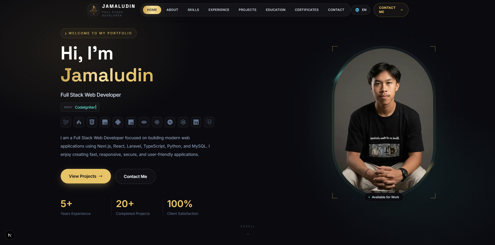
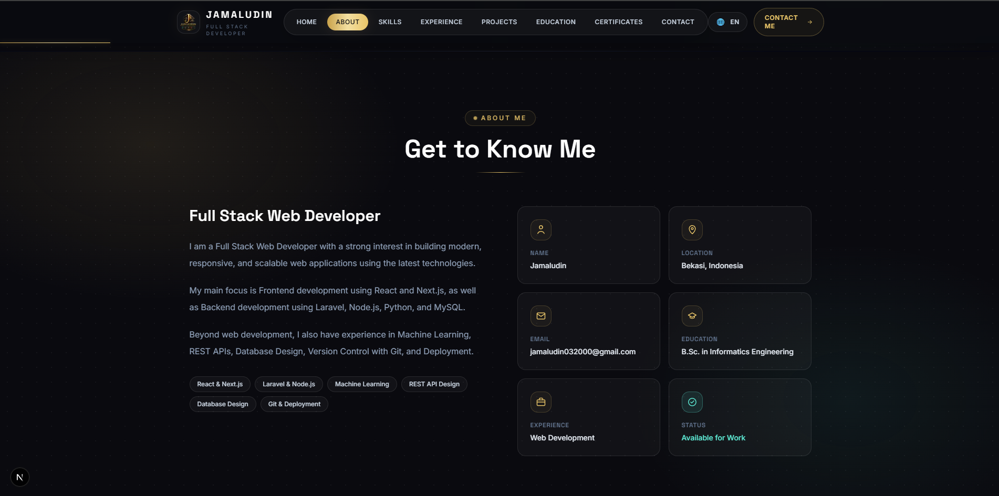
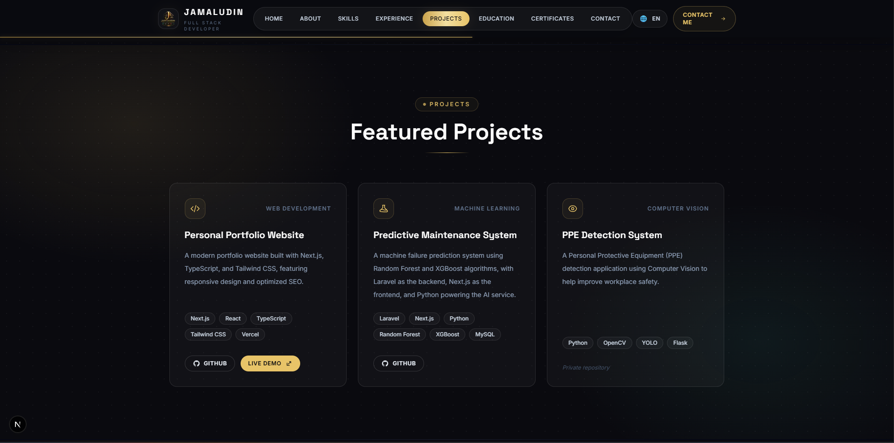
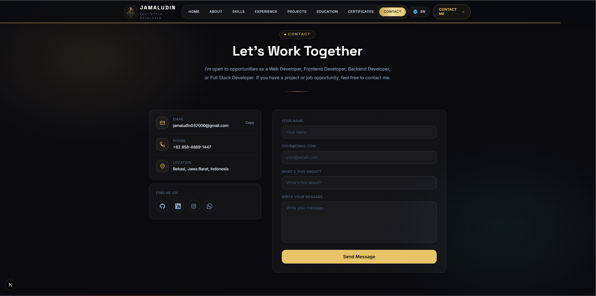

# Jamaludin Portfolio

Personal portfolio website built with **Next.js, TypeScript, and Tailwind CSS**.

A modern responsive portfolio website to showcase my profile, skills, projects, and contact information.

## 🚀 Tech Stack

- **Framework:** Next.js 15
- **Language:** TypeScript
- **Styling:** Tailwind CSS
- **UI:** Modern Responsive Design
- **Deployment:** Vercel

---

## 📸 Preview

### Home

### About

### Projects

### Contact

---

## ✨ Features

- ✅ Responsive Design (Desktop & Mobile)
- ✅ Indonesian & English Language Support
- ✅ Modern UI with Tailwind CSS
- ✅ Next.js App Router
- ✅ Portfolio Projects Showcase
- ✅ Contact Form
- ✅ Clean and Minimal Design

---

## 📂 Project Structure
